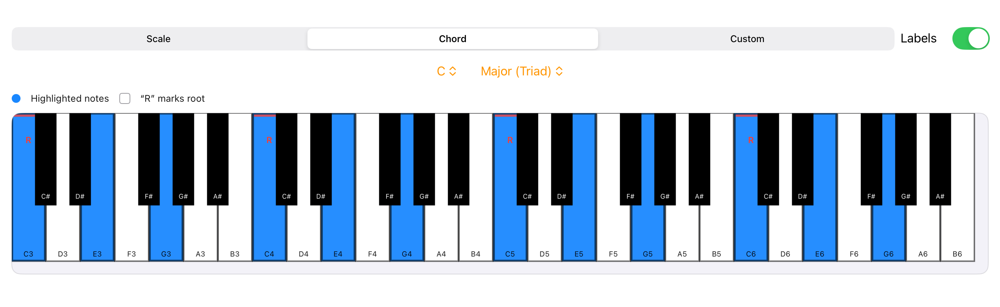
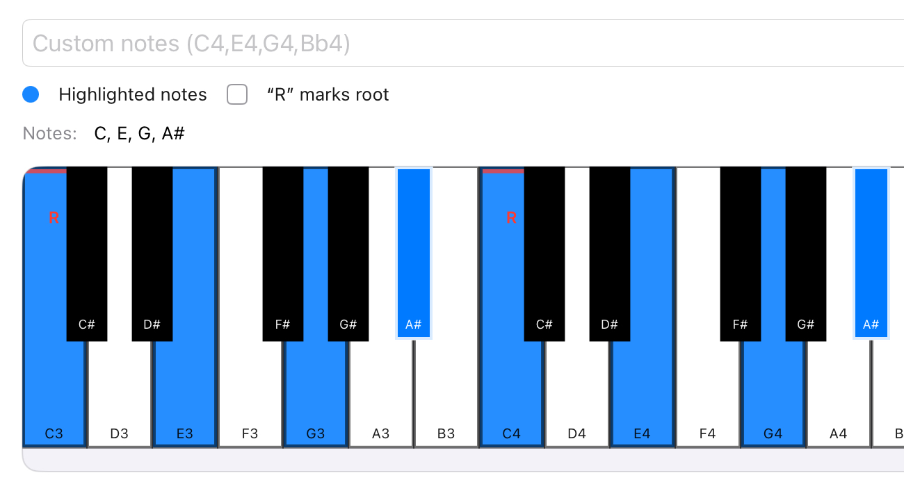

# 🎹 Piano Teacher

An interactive SwiftUI/Canvas piano keyboard for learning scales, chords, and improvisation.  
Built for iPad **Swift Playgrounds** or macOS/iOS via **Xcode**.

  

## ✨ Features

- **4-octave keyboard (C3–B6)** with centered black keys  
- **Highlight scales and chords** by selecting a root + type  
- **Custom mode**: tap keys directly to toggle them on/off  
- **Live note readout**: see the notes you tapped in real time  
- **Chord detection (basic)**: matches simple triads & sevenths (root position only for now)  
- **Root marker**: “R” badge shows the root note  
- **C locator stripe**: small red line above every C for instant orientation  
- **Labels toggle**: show or hide note names  
- **Dark & light mode** compatible  
- **SwiftUI wrapper + UIKit drawing** for efficient rendering  
- **MIT licensed** (see below)

## 📸 Features Showcase

### Chord Selection

  

### Scale Selection

  

### Note Detection (touch)

  

## 📱 Getting Started with Swift Playgrounds (on your iPhone or iPad)

1. Create a new **App** project in Swift Playgrounds.  
2. Delete the default `ContentView.swift` contents.  
3. Paste the full code from this repository’s `ContentView.swift`.  
4. Keep the auto-generated `MyAppApp.swift` (or similar) as-is.  
5. Run ▶️ — you’ll see the interactive keyboard.

Tips:
- Use the segmented control to switch between **Scale**, **Chord**, and **Custom** modes.  
- In Custom mode, tap keys to toggle them and see the note list update.  

## 💻 Compiling with Xcode (macOS)

1. Open **Xcode** and create a new **iOS App** project.  
2. Delete the auto-generated `ContentView.swift` file.  
3. Add a new Swift file called `ContentView.swift` and paste in the code.  
4. Make sure your `App` struct (e.g. `MyAppApp.swift`) still loads `ContentView()`.  
5. Build and run in the Simulator or on a connected device.

## 📄 License

This project is licensed under the [MIT License](LICENSE).
